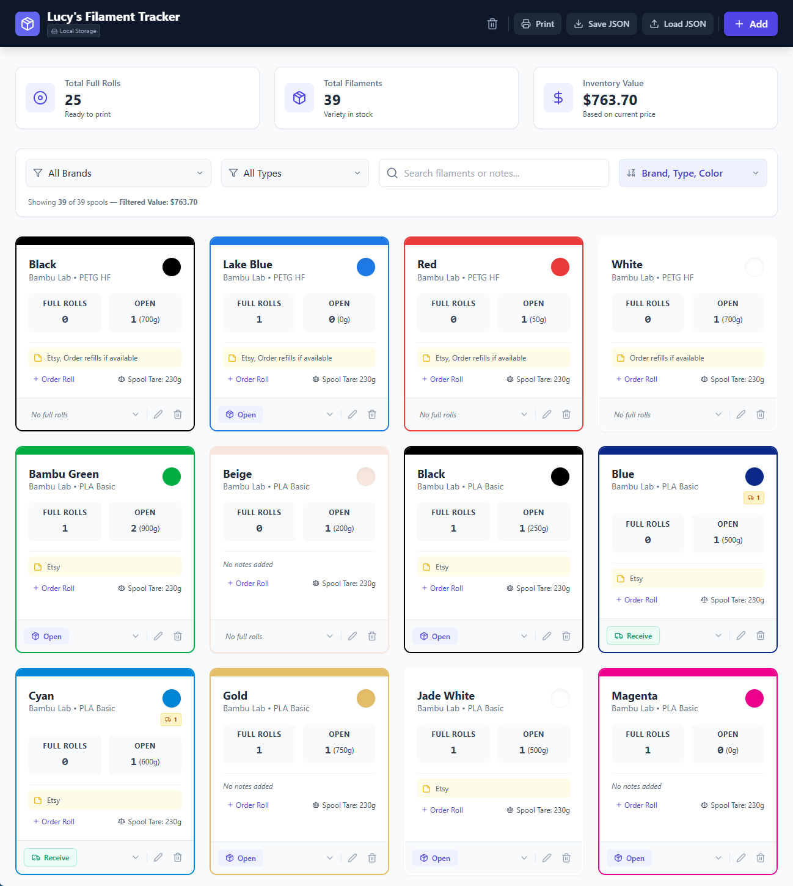

# Lucy's Filament Tracker
**Browser-based 3D printing filament inventory management.**

### **Version: 1.7**

### **Last Updated: 2026-02-23**

### **Developer: Ed Johnson (Making With An EdJ)**

## **Introduction: The "Why" and "What"**

Tracking filament shouldn't take longer than the print itself. I built this tool to solve the "partial roll" headache—knowing exactly how many grams are left on a spool without having to do math every time.

**Lucy's Filament Tracker** is a lightweight, privacy-focused utility that runs entirely in a single file in your browser. No account required, no database to install, and no data leaves your machine.

### **Key Features**

* **Fast Entry:** Seed your inventory from a Google Sheet (70+ rolls in < 30 mins).  
* **Smart Filtering & Deep Search:** Cross-filter by Brand and Material Type (PLA, PETG, etc.), and use the search bar to dynamically scan through Color Names, Main Notes, and individual Partial Roll Notes.
* **Card Sorting Options:** Organize your dashboard with sorting modes: **[Brand, Type, Color]**, **[Color, Type, Brand]**, or the **[Order View]** which automatically pins incoming orders to the top and highlights low-inventory items.  
* **Consumption Tracking:** "Open" full rolls to automatically track partial weights and spool tare.
* **Order Tracking:** Keep tabs on filament currently in the mail. Instantly "Receive" ordered rolls with a single click, or quick-add to your order list right from the dashboard.
* **Filament Inventory Report:** Generate a clean, printer-friendly "Shopping List" or inventory audit. This report includes a dedicated **Filtered Value** calculation and explicitly flags incoming orders so you don't accidentally double-buy.
* **Data Safety:** Visual "Unsaved Changes" warnings alert you when you need to back up your data.  
* **Total Inventory Value:** Automatically calculates the dollar value of your entire "plastic bank."

## **How to Run**

This is a **Standalone HTML** application. There is nothing to install on your computer.

1. **Download:** Download the `lucys_filament_tracker.html` file from this repository.  
2. **Run:** Double-click the file to open it in your favorite web browser (Chrome, Safari, or Edge).  
3. **Persistence:** Your data is temporarily saved to your browser's local cache. However, it is **highly recommended** to use the "Save JSON" button to create a hard backup on your computer whenever the "Unsaved Changes" warning appears.

*Pro-Tip: You can customize the app icon in the header by opening the HTML file in a text editor and pasting a Base64 image string into the `APP_ICON` variable near the top!*

## **Google Sheets Setup Guide (Optional)**

If you have a large collection of filament, you can use a Google Sheet to bulk-load the app and act as a master backup. Here is how to set it up:

### **Option 1: The Easy Way (Copy Template)**

If you are using Ed's shared template:

1. Open the shared Google Sheet. Link:  
   [Lucy's Filament Tracker JSON Database](https://docs.google.com/spreadsheets/d/14-P-dQ70ru4acR4fKjPGLLQhgiZi4NBXobUuJj-0JMs/edit?usp=sharing)  
2. Go to **File > Make a copy**.
3. **Authorization:** The first time you run the script (under the "Filament Tracker" menu), Google will warn you that the app isn't verified.  
   * Click **Advanced**.  
   * Click **Go to Filament Tracker (unsafe)**.  
   * *Note: This is standard for private scripts; it just means the script hasn't been reviewed by Google's global security team.*

   ### **Option 2: The "From Scratch" Way**

If you want to build your own sheet or use an existing one:

**1. Tab Name** Rename your data tab to exactly **Inventory** (case-sensitive). The export script specifically looks for this name and will ignore other tabs like "Notes" or "Calculations."

**2. Spreadsheet Structure** Set up the first row (Header Row) with these exact **12** columns in this order:

| Column | Header Name | Format / Example |
| ----- | ----- | ----- |
| **A** | ID | Leave empty (Script will automatically generate GUIDs) |
| **B** | Brand | Text (e.g., `Bambu Lab`) |
| **C** | Type | Text (e.g., `PETG-HF`) |
| **D** | Color Name | Text (e.g., `Bambu Green`) |
| **E** | Hex Color | Hex Code (e.g., `#00AE42`) |
| **F** | Full Rolls | Number (e.g., `2`) |
| **G** | Partial Weights | Comma separated numbers (e.g., `450, 120`) *Note: leave a space after each comma (forces text formatting) so you don’t create a partial spool with 450120 g. (Ask me how I know!)* |
| **H** | Price | Number (e.g., `24.99`) |
| **I** | Spool Weight | Number (e.g., `250`) |
| **J** | Notes | Text (e.g., `Cardboard spool, needs adapter`) |
| **K** | Partial Notes | Comma separated text (e.g., `Scrap, “Brittle, Dry First”`) - Order matches weights in Col G |
| **L** | Ordered Rolls | Number (e.g., `2`) |
| **M** | Location | Text (e.g., `Shelf 2, Bin A`) |

**3. Install the "JSON Helper" Script** This script converts your rows into the JSON format the app expects, and vice-versa.

1. In your Google Sheet, go to **Extensions > Apps Script**.  
2. Delete any default code (`function myFunction() {...}`) and paste the code from the `Code.gs` file in this repository.  
3. Click the **Save** icon (floppy disk).  
4. Refresh your Google Sheet tab.  
5. You will now see a new menu item called **"Filament Tracker"** at the top.

### **How to Export Data (Sheet ➔ Web App)**

* Under the **Filament Tracker** menu, click **Export JSON File**.  
* This prompts you to download a `lucy_inventory.json` file. (Right-click the download link in the prompt to choose the exact folder/filename if your browser is set to auto-download). Once downloaded, simply click **Load JSON** in the web app and select this file.

### **How to Import Data (Web App ➔ Sheet)**

To safely back up the changes you've made in the browser back into your master spreadsheet:

1. In the web app, click **Save JSON** to download your updated inventory to your computer.  
2. In your Google Sheet, click **Filament Tracker > Import JSON File**.  
3. Select your downloaded `.json` file.  
4. The script will automatically overwrite the "Inventory" tab with your updated data and instantly sort it cleanly by Brand, Type, and Color!

## **Tech Stack**

For the fellow coders and makers out there, here is how this was built:

* **Language:** React 18 (via CDN)  
* **Styling:** Tailwind CSS  
* **Icons:** Custom Internal SVG Library (Embedded for standalone stability)  
* **Data Storage:** Browser `localStorage` API + JSON File Export/Import  
* **Format:** 100% self-contained in a single `.html` file.

## **Acknowledgements & Credits**

* **Developer:** Ed Johnson ([Making With An EdJ](https://www.youtube.com/@makingwithanedj))  
* **AI Assistance:** Developed with coding assistance from Google's Gemini model.  
* **Lucy (The Cavachon Puppy):** ***Chief Wellness Officer & Director of Mandatory Breaks*** * Thank you for ensuring I maintained healthy circulation by interrupting my deep coding sessions with urgent requests for play.  
* **License:** Creative Commons Attribution-NonCommercial-ShareAlike 4.0 International License.

---

## Support the Maker (and Lucy!)

I develop these tools to improve my own parametric workflows and love sharing them with the community. If you find LiveUtilities useful and want to say thanks, feel free to **[buy Lucy a dog treat on Ko-fi](https://ko-fi.com/makingwithanedj)**! This is completely optional and supports my Chief Wellness Officer in maintaining mandatory play breaks. Your appreciation and feedback are more than enough.

***
*Happy Making!* *— EdJ*

## **Large Screenshot**

## **Appendix: Changelog**

### **[v1.7] — 2026-02-23**

**Added**
* **Location Tracking:** Added a dedicated "Storage Location" field to track exactly where each spool is stored (e.g., "Dry Box 1", "Shelf A").
* **Location Search:** The deep search bar now indexes the Location field, allowing you to instantly find all rolls in a specific storage container.
* **Card UI Update:** Added a subtle Map Pin icon and location text to the center of the filament card footer.
* **Google Sheets Sync:** Expanded the integration to 13 columns to fully support the new Location metadata.

### **[v1.6] — 2026-02-22**

**Added**

* **In-Transit Tracking:** Added a new `orderedRolls` integer field to track filament that has been purchased but not yet delivered.  
* **Quick Order Button:** Added a frictionless "+ Order Roll" button directly to the card interface to instantly increment the order count without opening the edit form.  
* **One-Click Receiving:** Added a "Receive" button to filament cards that automatically converts pending orders into full rolls and resets the order count.

**Improved**

* **Deep Search:** The search bar now indexes the main notes field as well as individual partial roll notes.  
* **Order View Sorting:** Updated the "Order View (Low Stock First)" sort option to automatically pin items currently in transit to the very top of the list.  
* **Printable Reports:** The Filament Inventory Report now explicitly flags incoming orders next to the Full Rolls count to prevent accidental double-ordering.  
* **Google Sheets Sync:** Expanded the Apps Script `Code.gs` integration to support 12 columns, safely importing and exporting the new `orderedRolls` metric.

### **[v1.5] — 2026-02-22**

**Added**

* **Dynamic Dashboard Sorting:** Integrated a new "Sort By" dropdown in the filter bar.  
  * *Brand, Type, Color:* Standard organization.  
  * *Order View (Low Stock First):* Prioritizes filaments with 0 full rolls and lowest partial weights to streamline ordering.  
  * *Color, Type, Brand:* Groups by color name for project-based material matching.  
* **Filtered Inventory Value:** Added real-time dollar value calculation to the search summary. The app now displays the specific value of the *currently filtered* items alongside the total collection value.  
* **Enhanced Reporting:** The "Print List" modal now includes the **Filtered Value** in the footer, allowing for targeted inventory audit reports.  
* **Version Tracking:** Added a hidden version metadata block in the HTML `<head>` and a subtle version label in the application footer for better organization.

**Improved**

* **Code Readability:** Refactored the internal application logic to an expanded, human-readable format to facilitate easier user-side customization.  
* **Report Layout:** Optimized the printable table with better spacing and bold weight for "Full Rolls" to improve scannability on physical printouts.

### **[v1.4] — 2026-02-21**

**Added**

* **"Lucy's Filament Tracker" Branding:** Officially named the app and added support for the `APP_ICON` Base64 customization.  
* **Spool Tare Tracking:** Added `spoolWeight` field to allow users to subtract the empty spool weight from the total scale reading.  
* **Partial Notes:** Added a dedicated note field for individual open spools (e.g., "Dry before use").

### **[v1.3] — 2026-02-19**

**Improved**

* **Local Storage Persistence:** Moved from volatile state to `localStorage`, ensuring data persists even if the browser tab is closed.  
* **"Dirty" State Detection:** Added the "Unsaved Changes" warning to alert users when their local data differs from their last exported JSON.  
* **Open Roll Logic:** Created the "Open Roll" button to automate the conversion of 1 Full Roll into a 1000g partial entry.

### **[v1.2] — 2026-02-18**

**Improved**

* **JSON Portability:** Developed the Import/Export logic to allow the app to function as a standalone utility independent of the Google Sheets master.  
* **Mobile-Responsive Grid:** Refined the Tailwind CSS grid to transition from 4 columns on desktop to a single-column list on mobile devices.

### **[v1.1] — 2026-02-17**

**Changed**

* **Pivoted to Standalone HTML:** Moved the UI from a Google Apps Script web-dialog into a single, portable `.html` file that can be run locally from any computer.  
* **UI Refresh:** Switched from basic HTML tables to the "Card View" layout with hex-color borders for better visual identification.

### **[v1.0] — 2026-02-16**

**Initial Release**

* **Core Functionality:** Basic CRUD (Create, Read, Update, Delete) for filament rolls.  
* **Sheet Integration:** Initial Google Apps Script established to push data from the "Inventory" tab into a JSON format.
